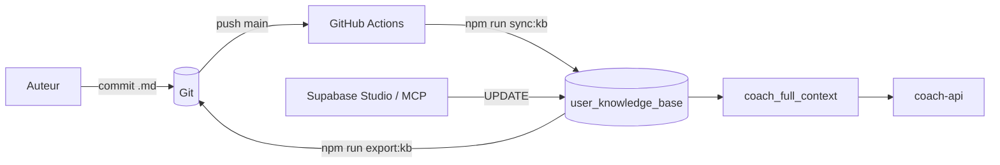

# Sync Base de Connaissance — `COACH_KNOWLEDGE_BASE.md` ↔ Supabase

Flux **bidirectionnel** entre le fichier versionné `COACH_KNOWLEDGE_BASE.md` et la table Supabase `user_knowledge_base`.

## Modèle

Le `.md` est structuré en deux parties :

- **Frontmatter YAML** (entre les `---` en tête) → colonnes structurées :
  `full_name`, `birth_date`, `location`, `primary_language`, `profession`,
  `psychological_profile`, `practices`, `coaching_style`, `life_goals`,
  `motivation_anchors`, `coach_notes`.
- **Corps markdown** (tout le reste) → colonne `raw_markdown`.

C’est le **frontmatter** qui alimente réellement le system prompt du coach
(voir [`supabase/functions/coach-api/index.ts`](../supabase/functions/coach-api/index.ts)).
Le corps markdown sert d’archive humaine lisible.

## Variables d'environnement requises

| Variable | Rôle |
|---|---|
| `SUPABASE_URL` | URL du projet Supabase (ex. `https://xxx.supabase.co`) |
| `SUPABASE_SERVICE_ROLE_KEY` | **Clé service_role** (jamais exposée côté client) |
| `KNOWLEDGE_BASE_USER_ID` | UUID de la ligne `user_knowledge_base` à mettre à jour |

Côté GitHub Actions, les trois valeurs doivent être définies dans
**Settings → Secrets and variables → Actions**.

## Commandes

### MD → Supabase (push)

```bash
npm run sync:kb
```

- Lit `COACH_KNOWLEDGE_BASE.md`.
- Parse le frontmatter et le corps.
- Met à jour la ligne « Dernière mise à jour » du corps.
- `upsert` dans `user_knowledge_base` (`onConflict: user_id`).

Déclenché **automatiquement en CI** sur chaque push `main` qui touche
`COACH_KNOWLEDGE_BASE.md` ou les scripts
(voir [`.github/workflows/sync_knowledge_base.yml`](../.github/workflows/sync_knowledge_base.yml)).
Déclenchable aussi à la demande depuis l'onglet **Actions**.

### Supabase → MD (pull)

```bash
npm run export:kb
```

- Lit la ligne Supabase pour `KNOWLEDGE_BASE_USER_ID`.
- Reconstruit le `.md` = frontmatter YAML (colonnes structurées) + corps = `raw_markdown`.
- À utiliser **après** une édition directe via Supabase Studio ou le MCP Supabase.

## Migration DB requise

La colonne `raw_markdown` est ajoutée par
[`supabase/migrations/20260422_add_raw_markdown.sql`](../supabase/migrations/20260422_add_raw_markdown.sql).
À appliquer via `supabase db push` ou via le MCP Supabase (tool `apply_migration`).

## Diagramme



## Bonnes pratiques

- **Ne jamais** committer la clé `service_role_key` : c’est un secret de GH Actions / `.env.local`.
- En cas d’édition conjointe MD + Supabase, privilégier un **sens à la fois** :
  1. `npm run export:kb` pour récupérer Supabase en local
  2. éditer le `.md`
  3. `git commit` → le workflow CI pousse vers Supabase.
